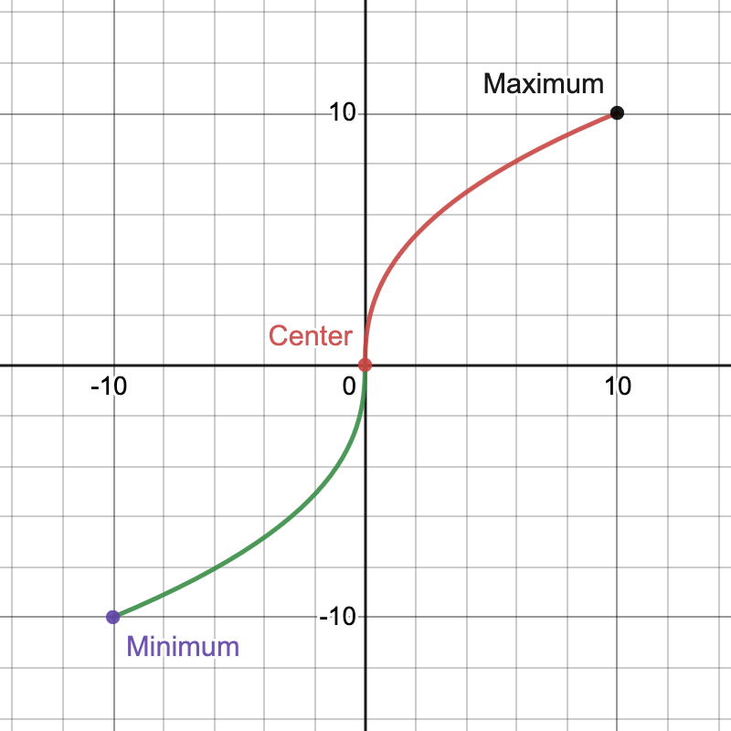
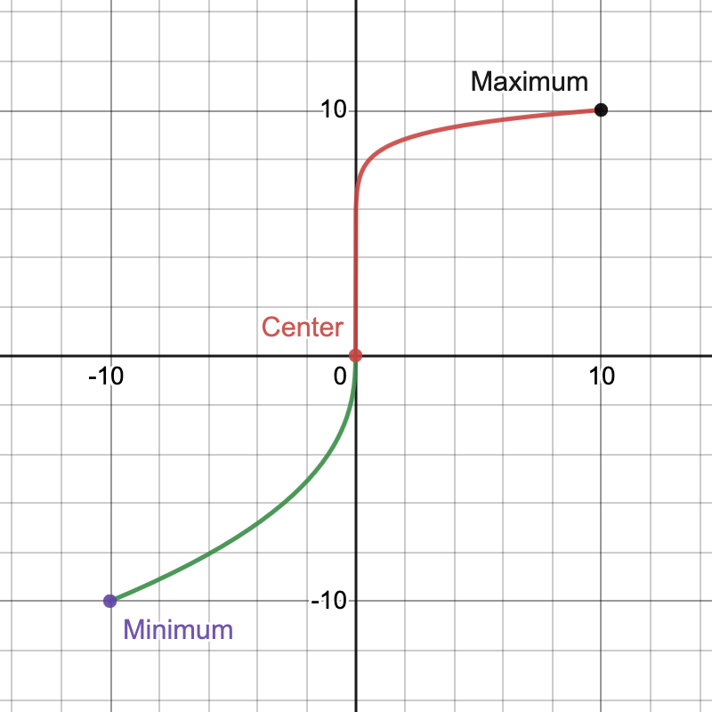

# Porsche Mü(h)k

### Raspberry Pi Pico powered HID joystick for an old Porsche tractor

# Table of Contents
1. [Features](#features)
2. [Description](#description)
3. [Pinout](#pinout)
4. [Settings](#settings)
   1. [Load Preset](#load-preset)
   2. [Save Preset](#save-preset)
   3. [Modify Preset](#modify-preset)
      1. [General Settings](#general-settings)
      2. [Axes Settings](#axes-settings)
      3. [Button Settings](#button-settings)
  
   4. [Reinit Joystick](#reinit-joystick)
   5. [Reset Preset](#reset-preset)
   6. [Factory Reset](#factory-reset)
   7. [Disable Output](#disable-output)
5. [Notes](#notes)

# Features

- upto 8 analog axes
- upto 24 digital buttons
- fully customizable axes control curves
- fully customizable button behavior
- 10 different config presets
- easy control over rotary controller and LCD
- acts as gamepad or keyboard
- expandable 

# Description

Porsche Mü(h)k is a Raspberry Pi Pico powered controller
to emulate a HI-Device to control various games by using real actuators such as steering wheel,
gas and break pedal of a real tractor/car.
Various actuators can be connected either as analog or digital sensors, like potentiometers and buttons.
It can emulate a gamepad/joystick or a keyboard, depending on which mode is desired.
Each analog axis can operate in one of four different modes, giving full control over the behavior of the axis.

**It may be useful to use an emulator on the host PC to further configure the axes and buttons.**
# Usage

1. Connect all analog and digital actuators according to the pinout guide
2. Connect the Pico to a computer/laptop
3. Load/modify a preset
4. Have fun!

# Pinout

**Note**  
0 = Axis/Button 0 in software.  
If an axis/button is connected to port 2, but in software only two axes/buttons are selected,
the input is not sampled and has no output.

### Analog Headers

<pre> 
            +-----------+
+-----------+-----------+-----------+
|           |           |           |
|     A     |    GND    |    Vcc    |
|           |           |           |
+-----------+-----------+-----------+
</pre>

- A = Analog Input  
- GND = GND
- Vcc = Vcc (3.3V)  

### Digital Headers
<pre>
      +-----------+
+-----------+-----------+
|           |           |
|     S1    |    S2     |
|           |           |
+-----------+-----------+
</pre>

- S1 = Button contact 1
- S2 = Button contact 2

The Button must close or open these two connections.

**More detailed pinout in hardwareReadme**

# Settings

## Load Preset

1. Go to /Settings/Set Preset
2. Select desired preset
3. The Device will reset automatically

## Save Preset

1. Go to /Settings/Save Preset
2. Select desired preset
3. The config is saved to the preset

## Modify Preset

### General Settings
Menu: /Settings/General

- Number of Axes: Select the number of analog inputs/axes (0–8).
- Number of Buttons: Select the number of digital inputs/buttons (0–24).
- Digital Axis Mode: Set the mode for all axes
  - Analog: Axes will be emulated as analog axes (joystick)
  - Analog/Digital: Axes will be emulated as buttons on a joystick (only digital axes)
  - Keyboard: Axes and buttons will be emulated as a keyboard

On Analog/Digital and Keyboard mode, each axis will get two buttons/digital outputs assigned. 
One for an upper limit, one for a lower limit.
In these modes, an axis has only three states: center/off, upper limit, lower limit.

**Important:** After any change of these settings, you have to save the preset and restart the device! [Save Settings](#save-preset), [Reinit Joystick](#reinit-joystick)

### Axes Settings
Menu: /Settings/Axes/{*number of axis*}

- Calibrate: Calibrates the axis
- Base set: Sets the base of the control curve (only in exponential and logarithmic mode)
- Mode: Sets the mode of the axis (linear, exponential, logarithmic, digital)
- Digital Calibration: Calibration for digital mode

#### Calibration
It will calibrate your axis settings.  
Set the minimum position of the axis, this is the position where the output of the axis is the smallest.
Same with the maximum.  
If the center position is not calibrated, the center position is automatically set to the midpoint between minimum and maximum.
If the center is calibrated, one half of the calibration curve can be shorter/longer than the other.

#### Modes
- linear: The curve of the output is linear to the input
- exponential/logarithmic: The curve of the output is exponential/logarithmic to the input (based on base)
- digital: The axis has three states (center/off, upper limit, lower limit) in the general "Analog" mode these will be represented as an analog axis which is either 0, maximum or minimum.

#### Base set
In exponential and logarithmic mode, the base will set the curvature/steepness of the output curve.  
The output curve is split in two halves (base 0 and base 1).
Each base can be set separately, or both bases can be set to the same value.  
Base 0 is the base for the curve between minimum and the center, base 1 for the middle between maximum.  
For exponential curves the value should be greater than 0, for logarithmic curves the value should be smaller than 0.  
If the value is 0, it is linear.  
See also the diagrams below.

#### Digital Calibration
This will select the digital lower and upper limit of the axis.  
Set the position after which the lower/upper output/button should be pressed/set to minimum/maximum.  
All input values that are smaller/greater than the limit will result in the minimum/maximum output value.  
If the input value is between the boarder, no button is pressed (in (general) Analog/Digital or Keyboard mode) or the axis will be 0/center position ((general) Analog Mode).

#### Diagrams
The x-axis represents the input value.
- 0 = center (input) position
- -10 = minimum (input) position
- 10 = maximum (input) position

All of these values can be calibrated with axis calibration.

The y-axis represents the output value (analog mode only)
- 0 = center/0 output
- -10 = minimum (output) value
- 10 = maximum (output) value

Base 0 is the base for the curve between minimum and the center, base 1 for the middle between maximum.

These values will can't be directly controlled.

##### Linear curves:

| Linear axis curve without center calibration                                                                      | Linear axis curve with (different) center calibration                                                                | Linear axis curve with (different) center calibration, different minimum calibration                                      |
|-------------------------------------------------------------------------------------------------------------------|----------------------------------------------------------------------------------------------------------------------|---------------------------------------------------------------------------------------------------------------------------|
|  |  |  |

##### Exponential curves:
| Exponential axis curve without center calibration, same bases                                                          | Exponential axis curve without center calibration, different bases                                                        | Exponential axis curve with (different) center calibration, different bases                                                   |
|------------------------------------------------------------------------------------------------------------------------|---------------------------------------------------------------------------------------------------------------------------|-------------------------------------------------------------------------------------------------------------------------------|
|  |  |  |

##### Logarithmic curves:
| Logarithmic axis curve without center calibration, same bases                                                       | Logarithmic axis curve without center calibration, different bases                                                     | Logarithmic axis curve with (different) center calibration, different bases                                                |
|---------------------------------------------------------------------------------------------------------------------|------------------------------------------------------------------------------------------------------------------------|----------------------------------------------------------------------------------------------------------------------------|
|  |  |  |

##### Other curves (Combinations of all) :
| Exponential half with other half linear (without center calibration)                                                                                 | Exponential half with other half linear, (different) center calibration                                                                                       | Logarithmic half with other half exponential, (different) center calibration                                                                         |
|------------------------------------------------------------------------------------------------------------------------------------------------------|---------------------------------------------------------------------------------------------------------------------------------------------------------------|------------------------------------------------------------------------------------------------------------------------------------------------------|
|  |  |  |

**Note:**
There are many other ways to adjust the curves. See also the Desmos calculator: [Desmos calculator](https://www.desmos.com/calculator/y6jawpiyea)  
Note that the values of the Desmos calculator do not match those of the device.

### Button Settings

Menu: /Settings/Buttons/{*number of button*}

- Mode: Whether the button should behave as (temporary) button or as (toggle) button
- Type: Whether the button is NO (normally open) or NC (normally closed)

#### Mode
- Button: Button behaves as a button. There is only an output when the button is pressed.
- Toggle: Button behaves as a toggle button. Ont the first press the output goes high/1, the next press sets the output to 0/low.

#### Type
- Normally Open
- Normally Closed

Whether the button opens or closes on a press.

**Important:**
Axes and button settings are adapted immediately.
To keep them after the joystick is reloaded or turned off the settings must be saved. [Save Settings](#save-preset)  
There is no need to reinit the joystick after axes or button settings have changed.

## Reinit Joystick

This option reloads the joystick. 
All settings that are not saved will be lost.

## Reset Preset

The current selected preset will be set to factory settings.
After that, the joystick will be reloaded.

## Factory Reset

All settings (all presets) are set back to factory settings.
After that, the joystick will be reloaded.

## Disable Output
This setting disables the output of the computer.  
Especially useful in Keyboard mode.  
Press it again to enable the output again.

# Notes
The configuration/device can be tested on gamepad/joystick test websites/software.  
Example website I used for testing: [Gamepad tester](https://hardwaretester.com/gamepad)

More detailed hardware/software guides are under [READMEhardware](READMEhardware.md)/[READMEsoftware](READMEsoftware.md)  
There are also the board dimensions as well as the schematic/gerber files.

There are no settings stored on the Pico. So the Pico can also be used for other projects.

If there are any bugs/problems, or you have any questions, please contact me.

Mühk or Mük is are the same things. :)

( ._.)
