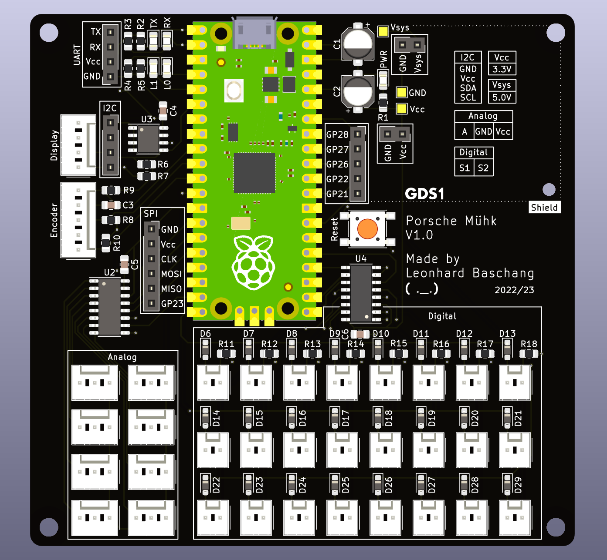
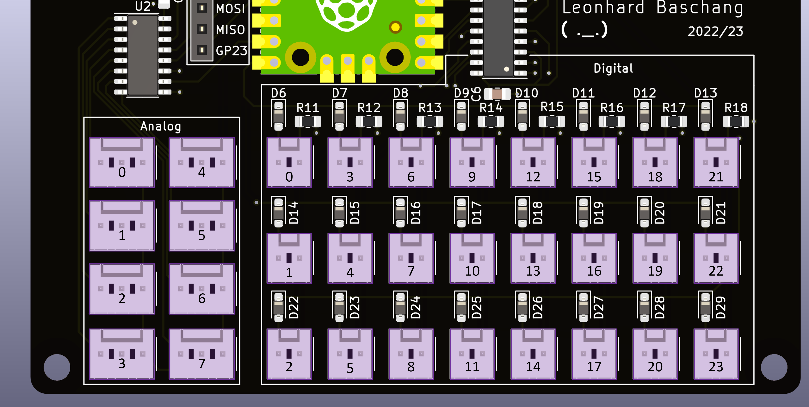
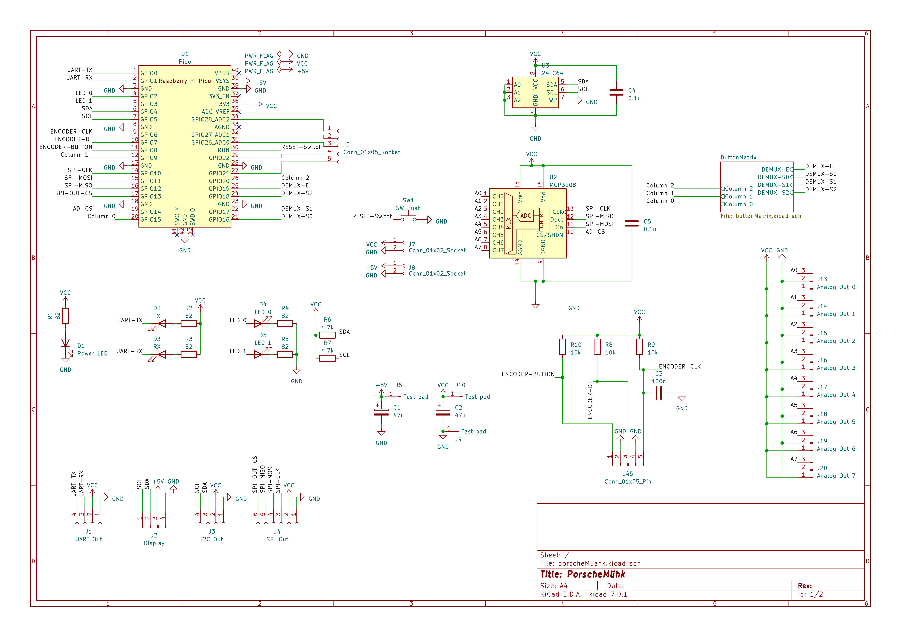
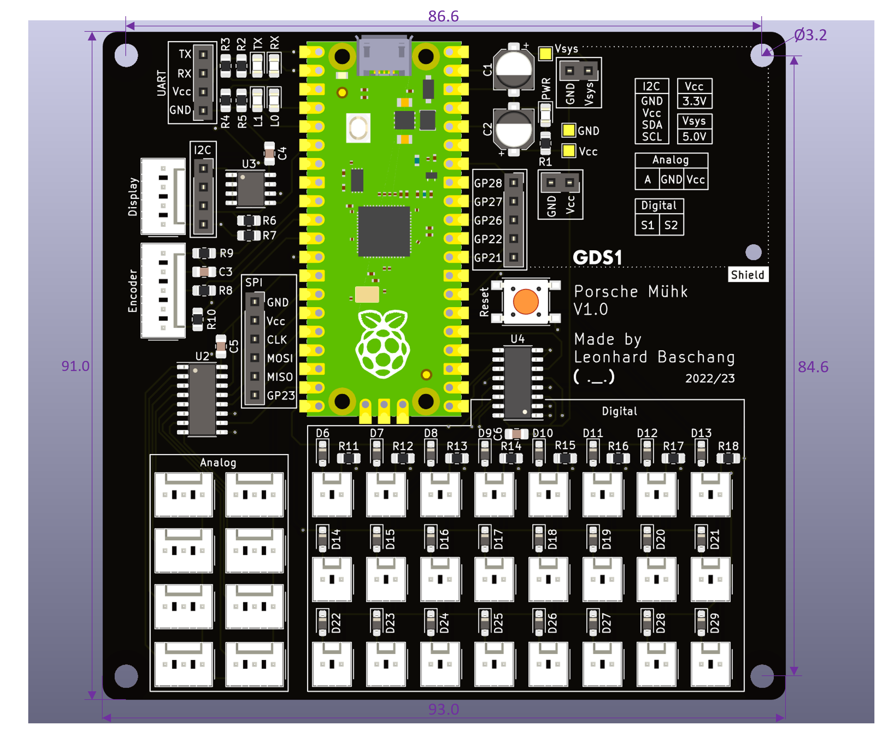
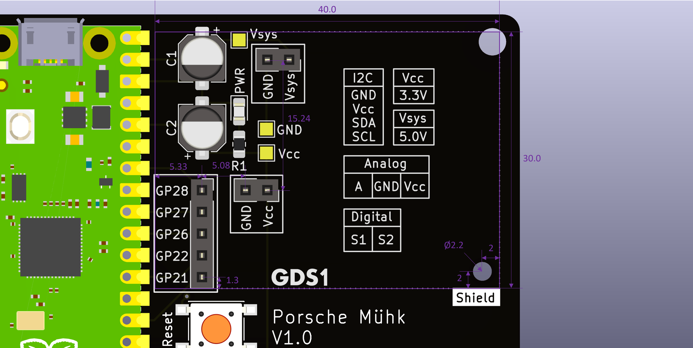

# Porsche Mühk Hardware

# Table of Contents
1. [Intro](#intro)
2. [Overview](#overview)
3. [Parts](#parts)
4. [Pinout](#pinout)
5. [Schematic](#schematic)
6. [Dimensions](#dimensions)

# Intro
This Readme file focuses on the hardware of Porsche Mühk.

# Overview
The main part is the Raspberry Pi Pico MCU.
All the configuration data is stored on an external (64 Kb) EEPROM, so that the MCU can be exchanged and used for other projects.  
A 8-channel 12-bit ADC is used to interface up to 8 analog sensors.  
An 8:1 analog multiplexer is used to further reduce the used pins of the Pico for the up to 24 digital inputs.  
The board has connections for a rotary encoder (with button) and an I2C LCD.  
The board also has an area and connections to add an extra shield that can add various functions.  
All buses (SPI, I2C, UART) are routed out, for easy debugging and/or add-ons/modifications.  
It has two LEDs for debug purposes.  
There is a 8x3 button matrix, with n-key rollover.
So each combination of buttons can be pressed and there is no ghosting.

# Parts
- U1: Raspberry Pi Pico ([Raspberry Pi Pico](https://www.raspberrypi.com/products/raspberry-pi-pico/))
- U2: 8-Channel 12-Bit SPI ADC ([Microchip MCP3208](https://www.microchip.com/en-us/product/MCP3208))
- U3: 64 Kb I2C EEPROM ([Microchip 24LC64](https://www.microchip.com/en-us/product/24LC64))
- U4: 8:1 MUX ([Microchip CD74HC4051](https://www.ti.com/product/CD74HC4051))

- Display: Basic 20x4 I2C LC-Display (e.g. [LCD 20x4 AZ-Delivery](https://www.az-delivery.de/en/products/hd44780-2004-lcd-display-bundle-4x20-zeichen-mit-i2c-schnittstelle))
- Rotary Encode: Simple Rotary Encoder with button (e.g. [Rotary Encoder AZ-Delivery](https://www.az-delivery.de/en/products/drehimpulsgeber-modul))

- Connector housings for digital connections [PSK 254/2W](https://www.reichelt.de/kupplungs-leergehaeuse-crimptechnik-2-polig-psk-254-2w-p14857.html)
- Connector housings for analog connections [PSK 254/3W](https://www.reichelt.de/kupplungs-leergehaeuse-crimptechnik-3-polig-psk-254-3w-p14858.html)
- Connector housings for display connection [PSK 254/4W](https://www.reichelt.de/kupplungs-leergehaeuse-crimptechnik-4-polig-psk-254-4w-p694.html)
- Connector housings for encoder connection [PSK 254/5W](https://www.reichelt.de/kupplungs-leergehaeuse-crimptechnik-5-polig-psk-254-5w-p14859.html)
- Crimp contact for the housings [PSK-Contacts](https://www.reichelt.de/crimpkontakte-fuer-psk-254--20-stueck-psk-kontakte-p14861.html)

# Pinout

**Note**  
0 = Axis/Button 0 in software.  
If an axis/button is connected to port 2, but in software only 2 axes/buttons are selected, the input is not sampled and no output.

### Analog Headers

<pre> 
            +-----------+
+-----------+-----------+-----------+
|           |           |           |
|     A     |    GND    |    Vcc    |
|           |           |           |
+-----------+-----------+-----------+
</pre>
- A = Analog Input
- GND = GND
- Vcc = Vcc (3.3V)

Analog In should not exceed Vcc (3.3V)

### Digital Headers
<pre>
      +-----------+
+-----------+-----------+
|           |           |
|     S1    |    S2     |
|           |           |
+-----------+-----------+
</pre>

- S1 = Button contact 1
- S2 = Button contact 2

Button must close or open these two connections.

### Display Header
<pre> 
            +-----------------------+
+-----------+-----------+-----------+-----------+
|           |           |           |           |
|    GND    |    +5V    |    SDA    |    SCL    |
|           |           |           |           |
+-----------+-----------+-----------+-----------+
</pre>
- GND = GND
- +5V = +5V
- SDA = SDA (GPIO 4)
- SCL = SCL (GPIO 5)

SDA and SCL have a logic level of Vcc (3.3V)

### Encoder Header
<pre>
            +-----------------------------------+
+-----------+-----------+-----------+-----------+-----------+
|           |           |           |           |           |
|    CLK    |    GND    |    DT     |    GND    |    BT     |
|           |           |           |           |           |
+-----------+-----------+-----------+-----------+-----------+
</pre>
- CLK = CLK-Pin of Encoder
- GND = GND
- DT = DT-Pin of Encoder
- BT = Button pin of Encoder

CLK, DT and BT are pulled up to VCC. To get a signal they need to be connected to GND.

**Note**  
During testing I found problem with presumably voltage spikes from the encoder when it is turned. 
To reduce them put a ceramic capacitor in parallel with a resistor in series with the CLK signal. 
This should be as close to the encoder as possible.
In a next version of the pcb, this maybe could be put on the pcb itself.
<pre>
                                 +------------+  
                           +-----+            +-----+
                           |     +------------+     |
                           |          100Ω          |
                           |                        |
CLK from Encoder +---------+                        +---------+ CLK to CLK Oin on Header
                           |                        |
                           |         |    |         |
                           |         |    |         |
                           +---------+    +---------+
                                     |    | 
                                     |    | 
                                      100nF
</pre>
### Notes
Note that all pins are only 3.3V tolerant.  
The various other connectors (SPI, I2C, UART, GPIO) are labeled on the silkscreen of the PCB.
CS of the ADC is on GPIO 14.  
LED 0 (L0) is connected to GPIO 2.  
LED 1 (L1) is connected to GPIO 3.

# Schematic

## Button matrix schematic

# Dimensions

## Shield Dimensions

## Notes
All the connectors for the shield are spaced with multiple of 2.54mm, so normal 2.54mm PCB can be used.  
All dimensions in mm.

( ._.)

